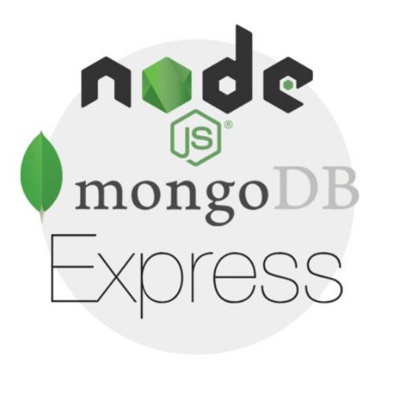
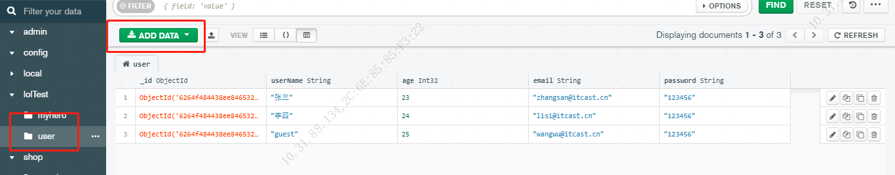

<p align="center">
  
</p>

<p align="center">
  <a href="https://github.com/vuejs/vue">
    
  </a>
  <a href="https://nodejs.org/zh-cn/">
    
  </a>
  <a href="https://github.com/ElemeFE/element">
    
  </a>
  <a href="https://www.mongodb.com/">
    
  </a>
  <a href="https://www.mongodb.com/">
    
  </a>
  <a href="https://opensource.org/licenses/MIT">
    
  </a>
</p>

## 总览

[vue-nodejs-mongodb-template](https://github.com/zhang-hue/vue-nodejs-mongodb-template) 是一个前后端联动的基础实现方案，它基于 [vue](https://github.com/vuejs/vue), [nodejs](https://nodejs.org/zh-cn/) 和 [mongodb](https://www.mongodb.com/)实现。原始版本的代码是由 [chengheai](https://github.com/chengheai) 开发维护的 [mongodb-vue](https://github.com/chengheai/mongodb-vue)， 十分感谢大佬对开源社区做出的贡献 :)

如果你想从一个十分简单的基础模版开始学习nodejs+mongodb实现增删改查的接口功能，本项目就很适合您，如环境配置有问题可以直接联系本人：。

## 截图




## 测试数据
``` txt
- public/data.json / public/userlist.json
```

## 功能
``` txt
- 登录 / 注销

- 接口功能
  - 增加
  - 删除
  - 修改
  - 详情

```

## 前序准备

你需要在本地安装 [mongodb](https://www.mongodb.com/) 和可视化工具 [mongodb-compass](https://www.mongodb.com/)。本项目后台技术栈基于 [express](https://www.expressjs.com.cn/)、[vue](https://cn.vuejs.org/index.html)、[vuex](https://vuex.vuejs.org/zh-cn/)、[vue-router](https://router.vuejs.org/zh-cn/) 、[vue-cli](https://github.com/vuejs/vue-cli) 、[axios](https://github.com/axios/axios) 和 [element-ui](https://github.com/ElemeFE/element)，后台使用nodemon插件热加载及mongoose插件，提前了解和学习这些知识会对使用本项目有很大的帮助。


## 如何设置以及启动项目
### 前端

### 安装依赖
```bash
npm install
```
### 启动本地开发环境（自带热启动）
```bash
npm run serve
```
### 构建生产环境 (自带压缩)
```bash
npm run build
```
### 后端

### 切换到服务器文件夹
```bash
cd server
```
### 启动node服务
```bash
node index.js
```
## 浏览器支持

Modern browsers and Internet Explorer 10+.

| [](http://godban.github.io/browsers-support-badges/)</br>IE / Edge | [](http://godban.github.io/browsers-support-badges/)</br>Firefox | [](http://godban.github.io/browsers-support-badges/)</br>Chrome | [](http://godban.github.io/browsers-support-badges/)</br>Safari |
| --------- | --------- | --------- | --------- |
| IE10, IE11, Edge| last 2 versions| last 2 versions| last 2 versions


